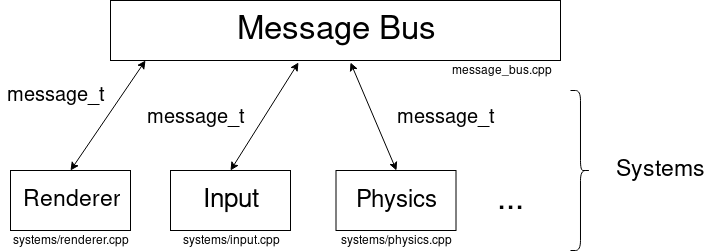

# Building
## Dependencies
- `glfw`
- `glm`

## Compiling
Just do `make` on the root directory

# Documentation
A `MessageBus` receives "events" ([`message_t`](message_bus.h)) and relays them to systems such as a renderer, physics engine, etc.
This was inspired by [this gamasutra post.](https://www.gamasutra.com/blogs/MichaelKissner/20151027/257369/Writing_a_Game_Engine_from_Scratch__Part_1_Messaging.php)

Game objects or [`Entity`](entity_pool.h) don't contain logic, they are simple structs constructed from an aggregate of components. They also contain a bitset where each bit represents a type of component.
Inspired by [Vittorio Romeo's talks.](https://www.youtube.com/watch?v=NTWSeQtHZ9M)

These entities are all stored in a global pool. [Here](entity_pool_global.cpp) and [here](entity_pool_global.h).
